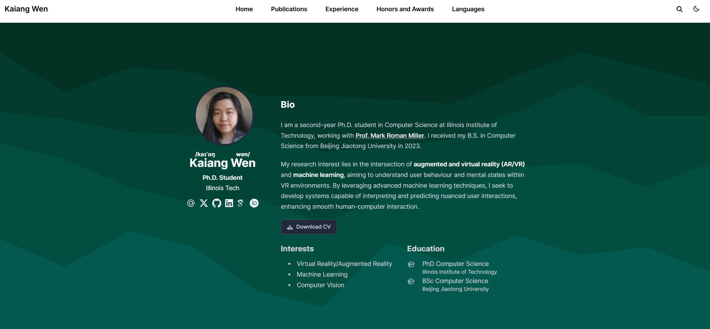

# Kaiang's Personal Website

Welcome to my website!

I am a Ph.D. student in Computer Science at Illinois Institute of Technology, working with [Prof. Mark Roman Miller](https://markromanmiller.com/). I received my B.S. in Computer Science from Beijing Jiaotong University in 2023.

My research interest lies in the intersection of **augmented and virtual reality (AR/VR)** and  **machine learning** , aiming to understand user behaviour and mental states within VR environments. By leveraging advanced machine learning techniques, I seek to develop systems capable of interpreting and predicting nuanced user interactions, enhancing smooth human-computer interaction.

<!--END_SECTION:news-->
